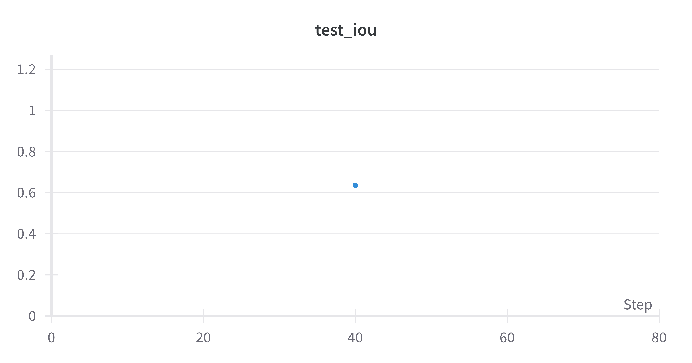

# unet-lung-segmentation
Standard Unet architecture for lung segmentation task.

# U-Net Lung Segmentation

This repository contains a Jupyter Notebook for performing lung segmentation using the U-Net architecture. The model is trained on a dataset of chest X-ray images, and the results are displayed in a 3x3 grid for easy visualization.

## Table of Contents

- [Introduction](#introduction)
- [Dataset](#dataset)
- [Loss Function](#loss-function)
- [Results](#results)

## Introduction

Lung segmentation is crucial in medical image analysis for various applications such as disease diagnosis, treatment planning, and follow-up assessment. The U-Net architecture is widely used for image segmentation tasks due to its efficiency and effectiveness in capturing context and precise localization.

## Dataset

This project utilizes the **Chest X-ray Masks and Labels** dataset from Kaggle, specifically for pulmonary chest X-ray defect detection. The dataset includes a variety of annotated chest X-ray images that facilitate the training and evaluation of segmentation models.

You can access the dataset [here](https://www.kaggle.com/datasets/nikhilpandey360/chest-xray-masks-and-labels).

## Loss Function

The model employs a loss function that combines **Binary Cross Entropy** (BCE) with **Intersection over Union** (IoU) to enhance the segmentation performance. This combination helps to better handle the imbalance between foreground and background classes, leading to improved accuracy in segmentation tasks.

## Results

The results of the segmentation are displayed in a 3x3 grid format. Below is an example of the output images:

 |  | 
|:----------------------------------:|:----------------------------------:|:----------------------------------:|
 |  | 
|:----------------------------------:|:----------------------------------:|:----------------------------------:|
 |  | 

You can find the results images in the `results` directory.

## Acknowledgements

- [U-Net: Convolutional Networks for Biomedical Image Segmentation](https://arxiv.org/abs/1505.04597)
- [Kaggle Chest Xray Masks and Labels Dataset](https://www.kaggle.com/datasets/nikhilpandey360/chest-xray-masks-and-labels)

